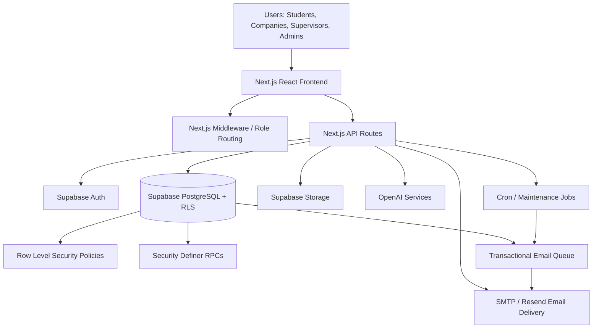
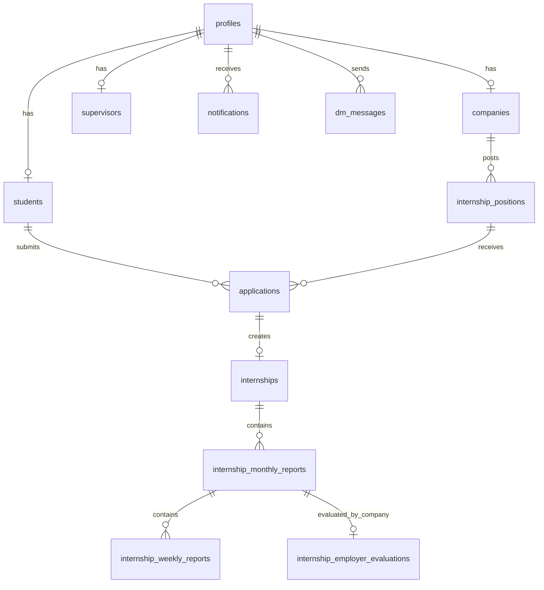
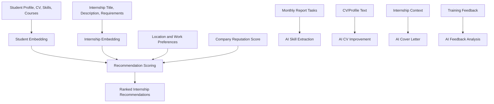

# InternConnect Jordan: An AI-Enhanced Internship Management Platform

## Abstract

InternConnect Jordan was developed as a full-stack internship management platform that connects students, companies, supervisors, and administrators in one secure digital environment. The project aimed to solve common problems in internship coordination, including fragmented application workflows, weak communication between stakeholders, manual supervision, limited visibility into student progress, and the difficulty of matching students with suitable internship opportunities. The platform was implemented as a production-oriented SaaS web application using Next.js, React, TypeScript, Supabase, PostgreSQL Row Level Security, Supabase Storage, and OpenAI-based artificial intelligence services.

The project methodology combined software engineering, database design, role-based access control, and AI-assisted decision support. The system was designed around four main user roles: students, companies, supervisors, and administrators. Students can create profiles, upload CVs, browse internships, apply, commit to accepted offers, submit monthly internship reports, and use AI-powered career support. Companies can post internships, review applicants, access authorized CV links, communicate with students, and evaluate trainees. Supervisors and administrators monitor progress, approve workflows, manage users, and review platform analytics. AI services were integrated for internship recommendations, semantic matching, student assistant chat, CV improvement, cover-letter generation, feedback analysis, report-to-skill extraction, company insight summaries, and supervisor analytics.

The final system demonstrates that an internship platform can go beyond basic listing and application management by using AI to improve matching quality, automate repetitive tasks, support student career development, and provide intelligent analytics. The project also showed the importance of production readiness features such as secure APIs, database-level authorization, background jobs, rate limiting, health checks, environment validation, testing, and deployment checklists. Although the system is now suitable for public beta usage, future work should focus on broader automated testing, full observability integration, a separate staging environment, further notification simplification, and scalable vector search infrastructure.

## Chapter 1: Introduction

### 1.1 Project Topic

Internships are an important bridge between academic education and professional employment. In universities, students are often required to complete practical training in companies before graduation. However, the process of finding suitable internships, applying, communicating with companies, reporting monthly progress, and receiving supervision is often fragmented across emails, spreadsheets, manual forms, and informal communication channels.

InternConnect Jordan addresses this problem by providing a centralized web platform for internship discovery, application management, company supervision, academic monitoring, communication, reporting, and AI-supported career guidance. The system was designed specifically for a multi-role internship workflow where students, companies, supervisors, and administrators each have different permissions and responsibilities.

### 1.2 Problem Statement

Traditional internship management suffers from several limitations:

- Students may struggle to find internships that match their skills, department, courses, CV, and career goals.
- Companies may receive applications without enough structured student information.
- Supervisors may have limited visibility into student progress and monthly reports.
- Administrators may need to manually approve company/supervisor accounts and monitor platform quality.
- Communication between students, companies, and supervisors may be scattered across external tools.
- Internship reporting and evaluation may be manual, slow, and difficult to analyze.

The main problem addressed by this project is how to build a secure, intelligent, and scalable internship platform that supports the complete internship lifecycle while using AI to improve matching, automation, and decision support.

### 1.3 Project Objectives

The project objectives were:

1. To build a full-stack web platform for internship management.
2. To support four roles: student, company, supervisor, and administrator.
3. To implement secure authentication and authorization using Supabase Auth, Row Level Security, and role-based routing.
4. To allow students to browse internships, apply, commit to offers, upload CVs, and submit monthly reports.
5. To allow companies to post internships, manage applications, access authorized CVs, evaluate students, and communicate with applicants.
6. To allow supervisors to monitor students, review internship reports, and access department-level insights.
7. To provide administrators with user management, onboarding approvals, moderation, analytics, and diagnostic controls.
8. To integrate AI services for recommendations, assistant chat, CV improvement, cover-letter generation, feedback analysis, report-skill extraction, and analytics summaries.
9. To improve production readiness through tests, rate limits, cron jobs, health checks, secure diagnostic endpoints, migration hardening, and deployment checklists.

### 1.4 Scope

The system covers the main internship lifecycle:

- Registration and login.
- Student profile and CV management.
- Company/supervisor onboarding request approval.
- Internship posting and browsing.
- AI-powered internship recommendations.
- Application submission and company decision.
- Student commitment to accepted offers.
- Direct messaging.
- Monthly internship reports and employer evaluations.
- Notifications and transactional emails.
- Admin moderation and analytics.
- AI-assisted feedback and reporting features.

The system does not yet include payment processing, mobile applications, enterprise monitoring dashboards, or a fully separate production/staging infrastructure, although the design supports these improvements in future work.

## Chapter 2: Background and Related Work

### 2.1 Internship Management Systems

Internship management systems are commonly used by universities, training offices, and career centers to coordinate students with external organizations. These systems usually provide basic features such as company registration, internship listings, student applications, supervisor assignment, and reporting. However, many systems still depend on manual review, fixed forms, and limited matching support. As a result, students may apply to unsuitable positions, companies may spend more time filtering candidates, and supervisors may only discover problems late in the internship period.

Modern internship platforms need to support more than record keeping. They should assist decision-making, automate workflows, protect student data, and provide real-time visibility for all stakeholders. This is especially important in academic environments where internships may be required for graduation and must be supervised according to university rules.

### 2.2 AI in Career Guidance and Recruitment

Artificial intelligence is increasingly used in recruitment and career guidance. AI can analyze CVs, extract skills, compare candidate profiles with job descriptions, summarize feedback, and generate personalized recommendations. Embedding models can represent text as numeric vectors, allowing systems to compare semantic similarity between students and internship opportunities. Large language models can also support natural-language tasks, such as cover-letter drafting, resume improvement, chatbot assistance, and feedback summarization.

However, AI in recruitment must be used carefully. Risks include hallucinated advice, biased recommendations, overreliance on automated scoring, privacy issues, and cost spikes caused by uncontrolled API usage. For this reason, this project uses AI as an assistive layer rather than as the sole decision maker. Final decisions remain with students, companies, supervisors, and administrators.

### 2.3 Related Platforms

Popular platforms such as LinkedIn, Handshake, Indeed, and university career portals provide job/internship discovery and application support. These platforms are effective for large-scale recruitment but often do not fully support university-specific internship supervision, monthly academic reports, supervisor approvals, employer evaluations, and administrative role approval workflows.

Learning management systems such as Moodle or Blackboard can support course submissions and academic communication, but they are not specialized for company internship matching, application workflows, CV access, or company-side trainee evaluation.

The gap addressed by InternConnect Jordan is the combination of:

- Internship discovery.
- Academic supervision.
- Company participation.
- AI-powered student support.
- AI-powered recommendation and analytics.
- Monthly internship reporting.
- Secure multi-role workflow.

### 2.4 Project Contribution

The main contribution of this project is an integrated internship SaaS platform that combines operational internship management with AI-assisted services. Unlike a simple internship listing website, the project includes authentication, authorization, role dashboards, secure storage, recommendations, reporting, notifications, email queue processing, direct messaging, AI feedback analysis, and production hardening.

## Chapter 3: Design Details

### 3.1 Overall Architecture

The system was designed as a serverless full-stack web application. The frontend and backend are both implemented inside a Next.js App Router project. Supabase provides authentication, PostgreSQL database, Row Level Security, remote procedure calls, and storage buckets. OpenAI provides language and embedding models used by the AI features. Email delivery is handled through SMTP and/or Resend.

Figure 1 shows the high-level architecture.

**Figure 1. Overall system architecture.**

### 3.2 User Roles

The platform contains four major roles.

| Role | Main Responsibilities |
|---|---|
| Student | Create profile, upload CV, browse internships, apply, commit to accepted offers, submit reports, use AI services |
| Company | Create company profile, post internships, review applicants, access CVs securely, message students, evaluate trainees |
| Supervisor | Monitor assigned/same-department students, review reports, access supervisor insights, communicate with students |
| Admin | Approve role upgrade requests, manage users, moderate content, access analytics, run diagnostics |

The role is stored in the `profiles` table. Signup creates a student profile by default, while company and supervisor accounts must submit onboarding requests that are approved by an administrator.

### 3.3 Authentication and Authorization Design

Authentication is handled by Supabase Auth. Authorization is enforced at three levels:

1. **Frontend routing:** Role-specific dashboards and navigation.
2. **Middleware:** Protected routes and role-based redirects.
3. **Database RLS:** Row Level Security policies and helper functions that restrict table access.

This layered design was selected because security should not depend only on the frontend. Even if a user calls Supabase directly, Row Level Security and database triggers protect sensitive data. Recent improvements also added a database trigger preventing non-admin users from changing protected profile columns such as `role` and `is_suspended`.

### 3.4 Database Design

The database is centered around `profiles`, which maps Supabase Auth users to platform roles. Related tables include:

- `students`
- `companies`
- `supervisors`
- `internship_positions`
- `applications`
- `internships`
- `internship_monthly_reports`
- `internship_weekly_reports`
- `internship_attendance`
- `internship_employer_evaluations`
- `notifications`
- `transactional_email_queue`
- `role_upgrade_requests`
- `dm_conversations`
- `dm_messages`
- `student_report_skills`
- `feedback_analysis`
- `student_recommendation_cache`

Figure 2 shows the main data relationships.

**Figure 2. Main database entity relationships.**

### 3.5 AI System Design

AI is one of the most important parts of the project. The platform includes several AI services:

| AI Service / Task | Purpose | Main Users |
|---|---|---|
| Internship recommendation engine | Matches students with internships using embeddings, deterministic scoring, company reputation, skills, and location preferences | Students |
| Student assistant chatbot | Answers internship, platform, and career-related questions | Students |
| Resume/CV improvement | Reviews student CV/profile content and suggests improvements | Students |
| AI cover-letter generator | Generates personalized cover letters for internship applications | Students |
| Task-to-skill extraction | Converts monthly report tasks into structured skills | Students |
| Feedback analysis | Analyzes student training evaluations for sentiment, keywords, and scoring | Companies/Admin |
| Company AI summary | Summarizes company reputation and feedback indicators | Companies/Admin |
| Supervisor department AI insights | Summarizes department-level student/application trends | Supervisors |
| Weekly insights | Provides student dashboard insights and suggestions | Students |
| Embedding generation/refresh | Generates vector representations for students and internships | Admin/Student/Company |

Figure 3 shows the AI workflow.

**Figure 3. AI services and data flow.**

### 3.6 Notification and Email Design

The system includes in-app notifications and queued transactional emails. The latest design uses `notifications` as the user-visible notification source and `transactional_email_queue` as the external delivery queue. A scheduled maintenance endpoint drains the email queue and performs background maintenance tasks. The queue includes attempts and error tracking, allowing failed emails to be retried and inspected.

### 3.7 Production Readiness Design

The platform includes several production-readiness controls:

- Admin-only email diagnostics.
- Required `CRON_SECRET` for queue processing.
- Shared database-backed rate limiting.
- Health endpoint at `/api/health`.
- Production environment validation script.
- Public launch checklist.
- Supabase migrations for security hardening.
- Authorization tests for sensitive endpoints.
- Clean lint and dependency audit.

## Chapter 4: Implementation Details

### 4.1 Technologies Used

| Category | Technology |
|---|---|
| Frontend | Next.js App Router, React, TypeScript |
| Styling | Tailwind CSS |
| Backend | Next.js API routes |
| Database | Supabase PostgreSQL |
| Authentication | Supabase Auth |
| Authorization | Supabase Row Level Security, middleware, role checks |
| Storage | Supabase Storage |
| AI | OpenAI embeddings and chat/completion models |
| Email | Nodemailer SMTP and Resend fallback |
| Testing | Vitest, ESLint, Next.js build checks |
| Deployment Target | Vercel + Supabase |

### 4.2 Frontend Implementation

The frontend was implemented using Next.js App Router. Each user role has dedicated pages and dashboard flows. Shared UI components are used for buttons, cards, modals, tables, badges, loading skeletons, layout shells, sidebars, notifications, messaging, and internship reports.

Important frontend areas include:

- Student dashboard.
- Internship browsing page.
- Internship details page.
- Student application list.
- Resume builder.
- AI assistant chat component.
- Company dashboard.
- Company internship management.
- Company applicant review.
- Supervisor dashboard.
- Admin dashboards.
- Notification pages.
- Direct messaging interface.

The system supports dark mode, responsive layouts, role-based navigation, and reusable layout components.

### 4.3 Backend and API Implementation

The backend is implemented as Next.js route handlers under `app/api`. Important API routes include:

- `/api/recommendations/internships`
- `/api/recommendations/internships/[internshipId]`
- `/api/chat/student-assistant`
- `/api/resume/improve`
- `/api/ai/cover-letter`
- `/api/ai/task-to-skill`
- `/api/feedback/analyze`
- `/api/embeddings/generate`
- `/api/embeddings/refresh`
- `/api/applications/apply`
- `/api/applications/commit`
- `/api/company/applications/[applicationId]/cv`
- `/api/company/logo`
- `/api/notifications/dispatch`
- `/api/notifications/process-email-queue`
- `/api/cron/maintenance`
- `/api/health`

Sensitive APIs verify the authenticated user, role, and ownership before using the Supabase service-role client. This is especially important for CV signed URLs, embeddings, feedback analysis, and notification dispatch.

### 4.4 AI Implementation Details

#### 4.4.1 Internship Recommendation Engine

The recommendation system generates embeddings for students and internships. Student embeddings are based on department, university, major, skills, CV summary, experience, projects, GPA, technical skills, soft skills, courses, and custom courses. Internship embeddings are based on title, work arrangement, description, and requirements.

The recommendation score combines:

- Semantic similarity between student and internship embeddings.
- Skill gap analysis.
- Student location and work arrangement preferences.
- Company reputation and confidence.
- Internship activity status.

Because the Supabase project does not support the required HNSW cosine vector index, a recommendation cache was added. The cache stores scored recommendations per student embedding version and location preference key, reducing repeated expensive calculations.

#### 4.4.2 Student Assistant Chatbot

The student assistant is an AI-powered chat feature that helps students with internship-related questions. It can guide students about applications, CVs, skills, and platform usage. It is rate-limited to prevent abuse and cost spikes.

#### 4.4.3 Resume/CV Improvement

The CV improvement API sends student CV/profile data to an AI model and returns suggestions for improving the summary, skills, experience, and project descriptions. This helps students improve the quality of their applications.

#### 4.4.4 Cover-Letter Generation

The cover-letter generator uses student profile information and internship context to generate a personalized cover letter. This reduces the effort required for students and helps them produce more professional application material.

#### 4.4.5 Task-to-Skill Extraction

The task-to-skill feature analyzes monthly internship report tasks and extracts structured skills. These skills can be added to the student profile or CV-related records. This connects real internship activities with measurable career development.

#### 4.4.6 Feedback Analysis

The feedback analysis service processes student training evaluations and extracts sentiment, keywords, normalized scores, and summaries. This helps companies and administrators understand internship quality and identify patterns in student feedback.

#### 4.4.7 Company and Supervisor AI Insights

The company AI summary and supervisor department insights provide higher-level analytics. Companies can understand feedback and reputation signals, while supervisors can review department-level student progress and application patterns.

### 4.5 Database and Security Implementation

Supabase migrations define the schema, policies, functions, storage buckets, and triggers. Row Level Security is enabled on important tables. Security-definer functions are used carefully to avoid RLS recursion and support controlled workflows.

Recent hardening work added:

- Profile protected-column trigger.
- RPC permission tightening.
- Database-backed API rate-limit table.
- Recommendation cache table.
- Notification/email idempotency columns.
- Cron-secret protection.
- Health check and production environment validation.

### 4.6 Storage Implementation

The system uses Supabase Storage buckets:

- `student-cvs` for private student CV files.
- `company-logos` for public company logo files.
- `internship-report-pdfs` for generated internship reports.
- `final-internship-reports` for final report uploads.

Companies cannot directly browse private CV storage. Instead, authorized company users request short-lived signed URLs through a protected API route.

### 4.7 Challenges Faced

Several implementation challenges were encountered:

- Designing secure role-based access across four roles.
- Avoiding database RLS recursion.
- Protecting service-role API routes.
- Managing AI cost and rate limiting.
- Supporting both in-app and email notifications.
- Handling Supabase pgvector limitations for ANN indexing.
- Creating reliable background maintenance without depending on page loads.
- Keeping the project production-ready while adding new features.

## Chapter 5: Experiments and Results

### 5.1 Validation Methodology

The project was validated using:

- ESLint for code quality.
- Vitest for authorization regression tests.
- Next.js production build for type checking and deployment readiness.
- Supabase migration push for database deployment verification.
- npm audit for dependency security.
- Manual flow review for student, company, supervisor, and admin workflows.

### 5.2 Production Readiness Results

| Metric | Before Improvements | After Improvements |
|---|---:|---:|
| Project readiness score | 72/100 | 84/100 |
| Lint status | Passed with warnings | Clean, no warnings |
| Test coverage | Minimal/none for high-risk routes | 4 test files, 12 passing tests |
| Dependency audit | 6 vulnerabilities | 0 vulnerabilities |
| Build status | Passed | Passed |
| Email diagnostics | Public/high risk | Admin-only |
| Cron queue processing | Public if secret missing | Requires `CRON_SECRET` |
| Rate limiting | In-memory only | Supabase-backed shared limiter |
| Role self-escalation protection | Policy-dependent | Database trigger blocks protected columns |
| Recommendation scalability | Recalculation-heavy | Cached recommendation fallback |

### 5.3 AI Feature Results

The AI services were successfully integrated as functional platform features:

- Students can receive AI-based internship recommendations.
- Students can ask career/platform questions through the assistant.
- Students can improve CV content using AI.
- Students can generate cover letters.
- Monthly report tasks can be transformed into structured skills.
- Student feedback can be analyzed into sentiment and summary values.
- Companies and supervisors can access AI-assisted insights.
- Embeddings can be generated and refreshed through protected routes.

These results show that AI is not only an optional add-on but a central part of the platform’s value. The system uses AI to improve student support, matching quality, reporting value, and analytics.

### 5.4 Comparison with Traditional Workflow

| Area | Traditional Workflow | InternConnect Jordan |
|---|---|---|
| Internship search | Manual browsing or external communication | Centralized listings with AI recommendations |
| Applications | Email/manual forms | Structured application workflow |
| CV review | Manual only | Secure CV access + AI improvement |
| Cover letters | Manually written | AI-generated personalized drafts |
| Monthly reports | Paper or separate documents | Built-in digital report workflow |
| Skill tracking | Often implicit | AI extraction from report tasks |
| Feedback review | Manual reading | AI sentiment and summary analysis |
| Notifications | Email/manual reminders | In-app + queued email notifications |
| Supervision | Limited visibility | Supervisor dashboard and report review |
| Security | Often role-light | Auth, RLS, middleware, protected APIs |

### 5.5 Limitations

The main limitations are:

- True ANN vector search is not available in the current Supabase pgvector setup.
- Staging environment must still be created outside the codebase.
- Real monitoring tools such as Sentry or Datadog are not yet fully integrated.
- Some legacy schema paths remain, such as older rating/preference structures.
- Test coverage should be expanded to include complete end-to-end user flows.

## Chapter 6: Conclusion and Future Work

InternConnect Jordan successfully implemented a secure and AI-enhanced internship management platform for students, companies, supervisors, and administrators. The project addressed the original problem of fragmented internship workflows by centralizing applications, role management, internship posting, communication, monthly reporting, notifications, CV access, and administrative control in one web platform. The system also introduced AI services that support students and stakeholders throughout the internship lifecycle.

The most important achievement of the project is the integration of AI into practical internship workflows. AI is used for semantic internship recommendations, student assistant chat, CV improvement, cover-letter generation, task-to-skill extraction, feedback analysis, company summaries, supervisor insights, and embedding refresh. These features improve the platform beyond a simple internship portal by helping students make better decisions, helping companies evaluate internship quality, and helping supervisors monitor progress more effectively.

The project also improved significantly in production readiness. Security-sensitive endpoints were protected, role escalation was blocked at database level, cron jobs were secured, rate limiting was made serverless-safe, dependency vulnerabilities were removed, lint warnings were cleaned, tests were expanded, migrations were pushed, and a public launch checklist was created. These improvements increased the project readiness score from approximately 72/100 to 84/100.

Future work should focus on moving from public beta readiness to mature production readiness. This includes creating a separate staging environment, adding full observability tools such as Sentry and uptime monitoring, expanding automated tests to cover complete user flows, simplifying legacy notification/database paths, and implementing a more scalable vector search solution. If Supabase vector support remains limited, a dedicated vector database or cached recommendation service could be used. A future mobile application and more advanced analytics dashboard could also improve adoption and usability.

## References

Amazon Web Services. (n.d.). *What is a vector database?* AWS. https://aws.amazon.com/what-is/vector-databases/

Next.js. (2026). *Next.js documentation*. Vercel. https://nextjs.org/docs

OpenAI. (2026). *OpenAI API documentation*. https://platform.openai.com/docs

PostgreSQL Global Development Group. (2026). *PostgreSQL documentation*. https://www.postgresql.org/docs/

Supabase. (2026). *Supabase documentation*. https://supabase.com/docs

Vercel. (2026). *Vercel documentation*. https://vercel.com/docs

Mikolov, T., Chen, K., Corrado, G., & Dean, J. (2013). *Efficient estimation of word representations in vector space*. arXiv. https://arxiv.org/abs/1301.3781

Reimers, N., & Gurevych, I. (2019). Sentence-BERT: Sentence embeddings using Siamese BERT-networks. In *Proceedings of the 2019 Conference on Empirical Methods in Natural Language Processing*. Association for Computational Linguistics. https://doi.org/10.18653/v1/D19-1410
