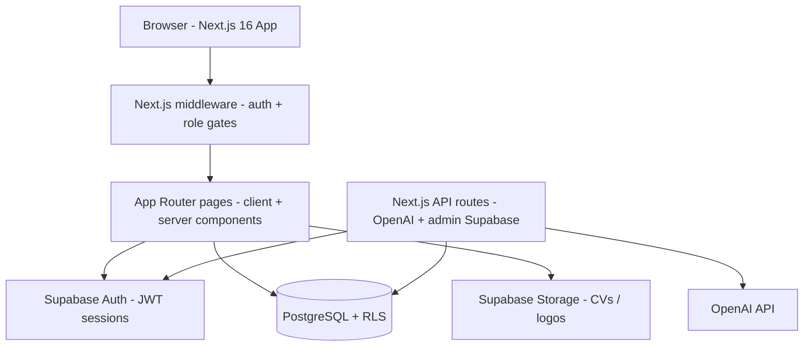
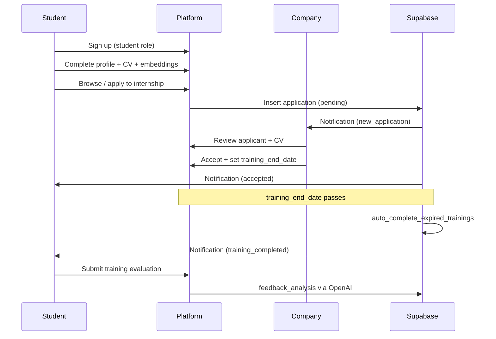

# InternConnect Jordan — Complete Project Guide

**InternConnect Jordan** (branded in the app as **AI Intern Jordan**) is a web platform that connects AI and Data Science students in Jordan with companies offering internships, while university supervisors monitor progress. The product targets Jordanian universities (JU, PSUT, GJU, etc.) and the local tech ecosystem.

This document reflects what is **actually in the repository today**, not only what the PRD plans for later.

---

## 1. High-level architecture



| Layer | Technology | Role |
|--------|------------|------|
| Frontend | Next.js 16, React 19, TypeScript, Tailwind CSS 4 | UI, routing, most business logic |
| Auth & data | Supabase (Auth, Postgres, Storage, RLS) | Users, data, security |
| AI | OpenAI (`openai` package) | Embeddings, chat assistant, resume help, feedback analysis |
| Backend (planned) | FastAPI (Python) | Documented in README/PRD but **not implemented** — `backend/` only contains `.env` |
| Docs | `CONTEXT_ENG/` | PRD, implementation plan, UI/UX, structure, bug tracking |

**Important:** The app talks to Supabase directly from the browser and from Next.js API routes. There is no working FastAPI server in the repo; `NEXT_PUBLIC_API_URL` in env is unused in frontend code. Admin analytics page is still a placeholder.

---

## 2. Repository layout

```
Intrenships_Platform-3/
├── frontend/          # Main application (Next.js)
│   ├── app/           # App Router pages + API routes
│   ├── components/    # UI, layout, domain components
│   ├── lib/           # Supabase clients, auth, AI, messaging, departments
│   ├── supabase/migrations/  # 52 SQL migrations (schema + RLS + RPCs)
│   └── public/        # Static assets (e.g. hero image)
├── backend/           # Only .env (FastAPI not built yet)
├── CONTEXT_ENG/       # Product & engineering documentation
└── README.md
```

---

## 3. User roles and permissions

Four roles are enforced in the database (`profiles.role`) and in **middleware** (`frontend/middleware.ts`):

| Role | Home route | What they can access |
|------|------------|----------------------|
| **Student** | `/dashboard/student` | Internships, applications, companies, profile, notifications, messages, resume builder |
| **Company** | `/dashboard/company` | Company dashboard, internship CRUD, applicants, messages, company profile |
| **Supervisor** | `/dashboard/supervisor` | Students (same department), reports, messages, supervisor profile |
| **Admin** | `/admin/dashboard` | Users, internships moderation, onboarding approvals, dashboard counts |

### Role upgrade flow (company / supervisor)

- Signup always creates `profiles.role = 'student'` (database trigger).
- If the user picks Company or Supervisor at signup, intent is stored in `role_upgrade_requests` with status `pending`.
- User completes onboarding forms (`/onboarding/company` or `/onboarding/supervisor`).
- While pending → `/pending-approval`.
- Admin approves/rejects via `/admin/onboarding-requests` (RPCs in migrations).
- Middleware redirects students with approved upgrade intent to company/supervisor dashboards.

### Departments (canonical, for supervisor–student matching)

- Computer Science
- Computer Information Systems
- Software Engineering

Aliases (CS, CIS, legacy IT, etc.) are normalized in `lib/departments.ts` and in SQL migrations.

---

## 4. Authentication and security

### Signup & login

- **Signup** (`/auth/signup`): email/password, role selection (student / company / supervisor), `full_name` in metadata, email confirmation redirect.
- **Login** (`/auth/login`), **verify** (`/auth/verify`).
- **Profile bootstrap**: `handle_new_auth_user` trigger creates `profiles` row; `lib/auth.ts` has `ensureProfile()` for server-side upsert.

### Route protection

- **Middleware** checks Supabase session, loads `profiles.role` and latest `role_upgrade_requests`, enforces role-specific path allowlists, redirects unauthenticated users to login with `?next=`.
- Public: landing `/`, all `/auth/*` paths that are not also “protected” overlaps.

### Data security

- **Row Level Security (RLS)** on all core tables; many migrations fix recursion and tighten company/supervisor read access.
- **Service role** used only in Next.js API routes via `lib/supabase/admin.ts` (embeddings, recommendations, feedback analysis, CV signed URLs).
- **Rate limiting**: in-memory per-user limits for chat and feedback analyze (`lib/server/in-memory-user-rate-limit.ts`).

---

## 5. Database model (Supabase PostgreSQL)

Core tables from `20260312001500_full_schema.sql` and later migrations:

| Table | Purpose |
|-------|---------|
| `profiles` | 1:1 with `auth.users`; email, full_name, role |
| `students` | University, major, department, skills, `cv_url` / `cv_path`, preferences, `embedding`, optional `supervisor_id` |
| `companies` | Company profile linked to profile |
| `internship_positions` | Listings: title, description, requirements, duration, `duration_weeks`, location, type, `is_active`, `embedding` |
| `applications` | Student → position; status; optional cover `message`; `accepted_at`, `training_end_date` |
| `ratings` | Legacy student→company ratings (1–5 + feedback) |
| `supervisors` | Department, title |
| `student_preferences` | Courses, GPA, skills, preferred work type/location, availability |
| `student_additional_info` | Extended profile for matching (technical/soft skills, courses, custom courses, preferred field) |
| `notifications` | In-app notifications with types and links to applications/conversations |
| `role_upgrade_requests` | Company/supervisor onboarding approval queue |
| `student_training_evaluations` | Post-internship ratings (overall, mentorship, environment, skills, recommend, notes) |
| `feedback_analysis` | AI-derived scores/sentiment/keywords per evaluation |
| `dm_conversations` / `dm_messages` | Direct messaging |

**Application statuses:** `pending` → `accepted` / `rejected` → `completed` (after training ends or manual completion).

### Database functions (examples)

- `auto_complete_expired_trainings()` — marks accepted apps completed when `training_end_date` passed; notifies student.
- `get_company_evaluation` — company reputation tier (`white` / `gray` / `black`) from aggregated feedback.
- `get_company_feedback_ai_summary` / `get_supervisor_department_ai_summary` — AI summaries for company/supervisor UIs.
- Student recommendation RPC (optional; API route can skip RPC via env flag).

### Views

`application_student_details` (and variants) — join application + student + additional info for company applicant review.

### Storage

Bucket `student-cvs` for PDF CVs (max 5MB on profile page).

### Extensions

`pgcrypto`, `vector` (1536-dim embeddings for students and positions).

---

## 6. Feature catalog by area

### 6.1 Public / marketing

- **Landing page** (`/`): hero, value props, CTA to signup/login, dark mode support.
- Branding: purple/indigo theme, Geist fonts, `next-themes` (light default).

### 6.2 Student features

| Feature | Route / location | Details |
|---------|------------------|---------|
| Dashboard | `/dashboard/student` | Application stats (pending/accepted/rejected), recent apps, “getting started” checklist (department, CV, apply, complete training), **AI student assistant chat** |
| Browse internships | `/internships` | Search, filters (location, skill, posted date, company, **company level** white/gray/black, sort, min match %), pagination, **AI recommendations** section |
| Internship detail | `/internships/[id]` | View listing, apply with optional message |
| My applications | `/applications` | Full list with status badges |
| Student profile | `/profile/student` | Name, university, **department**, major, bio, GPA, technical/soft skills, course picker (predefined + custom), work preferences, **CV upload** to storage |
| Companies directory | `/companies`, `/companies/[id]` | Browse companies; **evaluation panel** (avg score, level, feedback count) |
| Resume builder | `/resume-builder` | Build CV from profile data, **AI improve** via `/api/resume/improve`, export **PDF** with jsPDF |
| Messages | `/dashboard/student/messages` | DM with supervisors (same department) and companies (eligibility rules in DB) |
| My supervisor | `/dashboard/student/supervisor` | List supervisors in same department; open conversation |
| Notifications | `/notifications` + navbar dropdown | Mark read, link to related application or conversation |
| AI assistant | Embedded on dashboard + `/api/chat/student-assistant` | RAG-style context: internships, companies, applications, embeddings similarity, company evaluations, rate limited |

**AI recommendations** (`/api/recommendations/internships`):

- Cosine similarity between student `embedding` and position `embedding`.
- `buildMatchInsights`: matched skills, gaps, tips.
- Embeddings generated/refreshed via `/api/embeddings/generate` and `/api/embeddings/refresh`.

**Training lifecycle:**

- On accept, company sets training end from `duration_weeks`.
- `invokeAutoCompleteExpiredTrainings` calls DB function on dashboard/internships load.
- Completed internships → student can submit **training evaluation** → triggers **feedback analysis** (OpenAI).

### 6.3 Company features

| Feature | Route | Details |
|---------|-------|---------|
| Dashboard | `/dashboard/company` | Overview metrics and quick links |
| Company hub | `/company` | Navigation entry |
| Manage internships | `/company/internships` | List own positions |
| Create internship | `/company/internships/new` | `InternshipForm`: title, description, requirements, duration (+ weeks), location type, active flag |
| Edit internship | `/company/internships/[id]/edit` | Update or deactivate |
| Applicants | `/company/internships/[id]/applications` | Filter/search applicants, view **application_student_details** (skills, courses, GPA, bio), **open CV** via `/api/company/applications/[id]/cv`, accept/reject/complete, set training schedule on accept, sends **notifications** |
| All applications | `/company/applications` | Cross-listing view |
| Company profile | `/profile/company`, `/profile/company/create` | Name, description, location, website, contact, logo |
| Messages | `/company/messages` | DM with students who are allowed per RLS |
| AI feedback summary | `CompanyAiFeedbackSummary` | RPC `get_company_feedback_ai_summary` on company-facing pages |

### 6.4 Supervisor features

| Feature | Route | Details |
|---------|-------|---------|
| Dashboard | `/dashboard/supervisor` | Department-scoped overview |
| Students list | `/supervisor/students` | All students with **same department** (not only `supervisor_id` assignment) |
| Student detail | `/supervisor/students/[id]` | Application history, profile context |
| Reports | `/supervisor/reports` | Filterable table; **CSV-style export** of placement/application data |
| Profile | `/supervisor/profile` | Supervisor info |
| Messages | `/supervisor/messages` | DM with students in department |
| AI insights | `SupervisorAiInsights` | Department-wide feedback summary via `get_supervisor_department_ai_summary` |
| Onboarding | `/onboarding/supervisor`, `/auth/onboarding/supervisor` | Name, university, department for upgrade request |

### 6.5 Admin features

| Feature | Route | Details |
|---------|-------|---------|
| Dashboard | `/admin/dashboard` | Counts: students, supervisors, companies, positions, applications, **pending company/supervisor requests**, recent applications table |
| Users | `/admin/users` | User management UI |
| Internships | `/admin/internships` | Listing moderation / oversight |
| Onboarding requests | `/admin/onboarding-requests` | Approve/reject role upgrades with admin notes |
| Analytics | `/admin/analytics` | **Placeholder** — “Connect backend to load data” |
| Layout | `AdminSidebar` | Admin navigation shell |

### 6.6 Shared / cross-role

- **Notifications** types include: application accepted/rejected, new application, training completed, application expired, new feedback, new training evaluation, new direct message, info.
- **Companies pages** readable by students, supervisors, admins (per RLS).
- **Navbar**: theme toggle, notification bell, role-based home link, logout.
- **Sidebars**: `Sidebar`, `CompanySidebar`, `SupervisorSidebar`, `AdminSidebar` for role layouts.
- **UI kit**: `components/ui` (Button, Card, Table, Modal, Select, etc.) + `components/common` legacy duplicates.

---

## 7. Next.js API routes (server-side AI & privileged ops)

| Route | Purpose |
|-------|---------|
| `POST /api/embeddings/generate` | Generate OpenAI embeddings for student/position |
| `POST /api/embeddings/refresh` | Refresh stale embeddings |
| `GET /api/recommendations/internships` | Ranked internships + match insights |
| `POST /api/chat/student-assistant` | Conversational assistant with platform context |
| `POST /api/resume/improve` | AI suggestions for CV sections |
| `POST /api/feedback/analyze` | Analyze training evaluation text → `feedback_analysis` row |
| `GET /api/company/applications/[applicationId]/cv` | Secure CV access for company reviewers |

All require authenticated student/company/admin as appropriate; service role bypasses RLS where needed.

---

## 8. Frontend technical details

- **App Router** with route groups: `(public)`, role layouts under `dashboard/`, `company/`, `supervisor/`, `admin/`.
- **Client-heavy pages**: most dashboards use `"use client"` + Supabase browser client.
- **Server Supabase**: `lib/supabase/server.ts` for middleware and server components.
- **Types**: `lib/types.ts` — internships, applications, roles, statuses.
- **Env**: `NEXT_PUBLIC_SUPABASE_URL`, `NEXT_PUBLIC_SUPABASE_ANON_KEY`, `SUPABASE_SERVICE_ROLE_KEY`, `OPENAI_API_KEY`, optional `NEXT_PUBLIC_INTERN_RECOMMENDATIONS_SKIP_RPC`.

**Scripts:** `npm run dev`, `supabase:push` for migrations.

---

## 9. Company reputation system

From completed student training evaluations and AI analysis:

- Aggregated **average score** and star-style ratings.
- **Company level**: `white` (strong), `gray` (mixed), `black` (weak) — used as a filter on internship browse.
- Shown on company cards, detail pages, and fed into the student AI assistant.

---

## 10. Direct messaging

- Tables: `dm_conversations` (kinds: `student_supervisor`, `student_company`), `dm_messages`.
- Eligibility enforced in SQL (same department for supervisor; company–student relationship for company).
- UI: `DirectMessagesShell` on student/company/supervisor message pages.
- New messages create `new_direct_message` notifications with `related_conversation_id`.

---

## 11. What the PRD mentions but is NOT (or not fully) implemented

| PRD item | Status in repo |
|----------|----------------|
| FastAPI backend | Not present (only `backend/.env`) |
| Bookmark internships | No code |
| Email notifications | In-app only; no email integration found |
| Admin listing moderation before go-live | Partial admin UI; not full workflow |
| Supervisor CSV from dedicated export button | Reports page supports export-style data |
| `lib/api.ts` FastAPI wrapper | Not used |
| Admin analytics charts | Placeholder page |
| Mobile app | Future |
| Video interviews, skill tests | Future |

---

## 12. Documentation in `CONTEXT_ENG/`

| File | Content |
|------|---------|
| `PRD.md` | Product vision, personas, MVP features, future phases, KPIs |
| `Implementation.md` | Staged build plan (setup → auth → listings → …) |
| `Project_structure.md` | Intended folder layout |
| `UI_UX_doc.md` | Design guidelines |
| `Bug_tracking.md` | Known issues |
| `PROJECT_OVERVIEW.md` | This file — full project explanation |

---

## 13. Running the project

**Frontend:**

```bash
cd frontend
npm install
npm run dev
```

**Database:** Link Supabase project and run migrations (`npm run supabase:push`).

**Backend:** Documented as `uvicorn app.main:app` but there is no Python app in the repo yet.

---

## 14. Application flow (end-to-end)



---

## 15. Summary

**InternConnect Jordan** is a **Supabase-backed Next.js internship platform** with four roles, rich **student matching (embeddings + AI)**, **company applicant management**, **supervisor department monitoring**, **admin onboarding approvals**, **in-app notifications**, **direct messaging**, **training lifecycle** (accept → schedule → auto-complete → evaluate → AI feedback analysis), and a **resume builder with PDF export**.

The codebase has **grown beyond the original MVP PRD** in AI and messaging areas, while the **FastAPI layer and some admin analytics** remain planned rather than built. Almost all logic lives in `frontend/` with **52 SQL migrations** defining security and behavior in the database.
