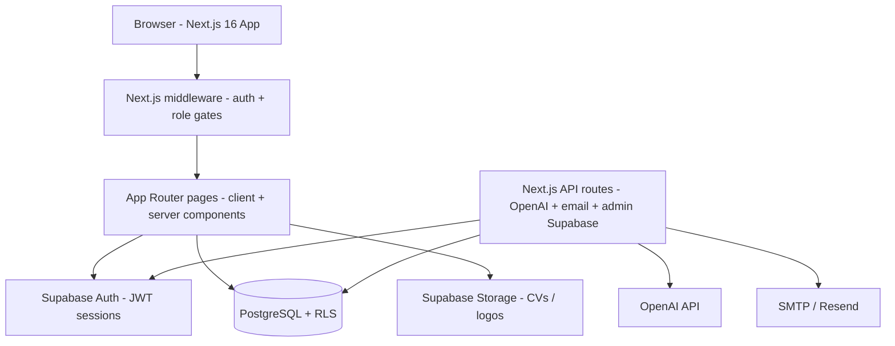
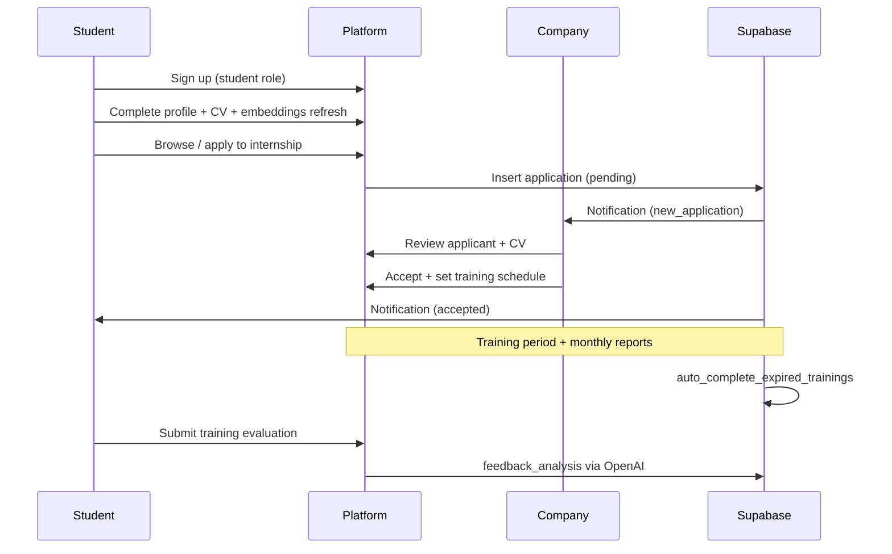

# InternConnect Jordan — Complete Project Guide

**InternConnect Jordan** (branded in the app as **AI Intern Jordan**) is a web platform that connects AI and Data Science students in Jordan with companies offering internships, while university supervisors monitor progress. The product targets Jordanian universities (JU, PSUT, GJU, etc.) and the local tech ecosystem.

This document reflects what is **actually in the repository today**, not only what the original PRD planned.

---

## 1. High-level architecture



| Layer | Technology | Role |
|--------|------------|------|
| Application | Next.js 16, React 19, TypeScript, Tailwind CSS 4 | UI, routing, client logic, **server API routes** |
| Auth & data | Supabase (Auth, Postgres, Storage, RLS) | Users, data, security |
| AI | OpenAI (`openai` package) | Embeddings, chat assistant, resume help, cover letter, task-to-skill, feedback analysis |
| Email | Nodemailer / Resend | Transactional email via API routes |
| Docs | `CONTEXT_ENG/` | PRD, implementation plan, UI/UX, structure, bug tracking |

**Important:** The app is a **full-stack Next.js project**. There is **no FastAPI/Python backend** in the repo. Most pages talk to Supabase directly (with RLS); sensitive operations use **Next.js Route Handlers** in `frontend/app/api/`.

---

## 2. Repository layout

```
Intrenships_Platform-1/
├── frontend/                    # Full-stack Next.js application
│   ├── app/                     # App Router pages + API routes
│   ├── components/              # UI, layout, domain components
│   ├── lib/                     # Supabase, auth, AI, i18n, messaging, …
│   ├── supabase/migrations/     # 70+ SQL migrations (schema + RLS + RPCs)
│   └── public/                  # Static assets
├── CONTEXT_ENG/                 # Product & engineering documentation
└── README.md
```

There is **no `backend/` folder**. All deployable code lives under `frontend/`.

---

## 3. User roles and permissions

Four roles are enforced in the database (`profiles.role`) and in **middleware** (`frontend/middleware.ts`):

| Role | Home route | What they can access |
|------|------------|----------------------|
| **Student** | `/dashboard/student` | Internships, applications, companies, profile, notifications, messages, resume builder |
| **Company** | `/dashboard/company` | Company dashboard, widgets, internship CRUD, applicants, messages, company profile |
| **Supervisor** | `/dashboard/supervisor` | Students (same department), reports, messages, supervisor profile |
| **Admin** | `/admin/dashboard` | Users, internships moderation, onboarding approvals, analytics |

### Role upgrade flow (company / supervisor)

- Signup creates `profiles.role = 'student'` (database trigger).
- Company or Supervisor intent → `role_upgrade_requests` (pending).
- User completes onboarding (`/onboarding/company` or `/onboarding/supervisor`).
- While pending → `/pending-approval`.
- Admin approves/rejects via `/admin/onboarding-requests`.
- Middleware redirects approved users to the correct dashboard.

### Departments (canonical, for supervisor–student matching)

- Computer Science
- Computer Information Systems
- Software Engineering

Aliases are normalized in `lib/departments.ts` and SQL migrations.

---

## 4. Authentication and security

### Signup & login

- **Signup** (`/auth/signup`): email/password, role selection, email confirmation.
- **Login** (`/auth/login`), **verify** (`/auth/verify`), **callback** (`/auth/callback`).
- **Profile bootstrap**: DB trigger + `lib/auth.ts` helpers.

### Route protection

- Middleware checks Supabase session, loads role and upgrade status, enforces path allowlists.
- Public: landing `/`, auth pages, browse listings where RLS allows.

### Data security

- **Row Level Security (RLS)** on core tables; extensive migration history for policy fixes.
- **Service role** only in Route Handlers via `lib/supabase/admin.ts`.
- **Rate limiting**: in-memory per-user limits on AI routes (`lib/server/in-memory-user-rate-limit.ts`).

---

## 5. Database model (Supabase PostgreSQL)

Core and extended tables (see `frontend/supabase/migrations/`):

| Table | Purpose |
|-------|---------|
| `profiles` | 1:1 with `auth.users`; email, full_name, role, gender, notification prefs |
| `students` | University, major, department, skills, preferences (JSON: bio, summary, projects, …), `cv_path`, `embedding` |
| `companies` | Company profile, logo, evaluation fields |
| `internship_positions` | Listings with embeddings, dates, requirements |
| `applications` | Student → position; status lifecycle; commitment fields |
| `student_additional_info` | Technical/soft skills, courses, GPA, preferences |
| `notifications` | In-app + email routing metadata |
| `role_upgrade_requests` | Company/supervisor approval queue |
| `student_training_evaluations` | Post-internship dimension ratings |
| `feedback_analysis` | AI analysis of evaluation text |
| `internship_monthly_reports` | JUST-style monthly report workflow |
| `student_report_skills` | AI-extracted skills from reports |
| `dm_conversations` / `dm_messages` | Direct messaging |
| `notification_email_queue` | Outbound email queue |

**Application statuses** include: `pending`, `accepted`, `rejected`, `completed`, commitment-related states, etc.

### Database functions (examples)

- `auto_complete_expired_trainings()` — training lifecycle automation
- `get_company_evaluation` / `get_company_student_feedbacks` — company reputation
- `get_company_feedback_ai_summary` / `get_supervisor_department_ai_summary` — AI summaries
- Student recommendation RPCs + API-side scoring

### Storage

- Bucket `student-cvs` for PDF CVs
- Company logos via upload API and storage

### Extensions

`pgcrypto`, `vector` (embeddings for students and positions).

---

## 6. Feature catalog by area

### 6.1 Public / marketing

- **Landing page** (`/`): hero, value props, bilingual support (EN/AR), dark mode.

### 6.2 Student features

| Feature | Route / location | Details |
|---------|------------------|---------|
| Dashboard | `/dashboard/student` | Widgets (training progress, recommendations, insights), AI assistant |
| Browse internships | `/internships` | Search, filters, AI recommendations, match scores |
| Internship detail | `/internships/[id]` | Apply, cover letter generator, skill gap / learning plan |
| My applications | `/applications` | Status, commitment flow, training evaluations |
| Student profile | `/profile/student` | Full profile + skills + CV upload |
| Resume builder | `/resume-builder` | AI improve, **persisted to profile**, PDF export |
| Companies | `/companies`, `/companies/[id]` | Browse + evaluation panel |
| Messages | `/dashboard/student/messages` | DM with supervisors and companies |
| Monthly reports | `/dashboard/student/internship-reports` | Report wizard and tracking |

**AI recommendations:** cosine similarity on embeddings + skill-gap insights; profile/CV fields feed embeddings after save.

### 6.3 Company features

| Feature | Route | Details |
|---------|-------|---------|
| Dashboard | `/dashboard/company` | Cyclic widgets (reputation, listings, trainee progress) |
| Manage internships | `/company/internships` | CRUD, pause/resume, applicant counts |
| Applicants | `/company/internships/[id]/applications`, `/company/applications` | Review, CV access, accept/reject, notifications |
| Trainee reports | `/company/internship-reports` | Monthly reports, attendance, evaluations |
| Company profile | `/profile/company` | Branding, logo, description |

### 6.4 Supervisor features

| Feature | Route | Details |
|---------|-------|---------|
| Dashboard | `/dashboard/supervisor` | Department overview |
| Students | `/supervisor/students`, `/supervisor/students/[id]` | Same-department students |
| Reports | `/supervisor/internship-reports`, `/supervisor/reports` | Report review and exports |
| AI insights | `SupervisorAiInsights` | Department feedback summary |

### 6.5 Admin features

| Feature | Route | Details |
|---------|-------|---------|
| Dashboard | `/admin/dashboard` | Platform counts |
| Users | `/admin/users` | User management |
| Internships | `/admin/internships` | Oversight |
| Onboarding | `/admin/onboarding-requests` | Role upgrade approvals |
| Analytics | `/admin/analytics` | Partial / evolving |

### 6.6 Shared

- **i18n**: English and Arabic (`lib/i18n/`)
- **Notifications**: in-app + email dispatch
- **Direct messaging** with RLS eligibility rules
- **Role-specific sidebars** and shared UI kit

---

## 7. Next.js API routes (server-side)

| Route group | Purpose |
|-------------|---------|
| `applications/` | Apply, commitment |
| `recommendations/internships` | Match scoring and insights |
| `embeddings/` | Generate and refresh vectors |
| `ai/cover-letter`, `ai/task-to-skill` | Student AI tools |
| `resume/improve` | CV AI suggestions |
| `chat/student-assistant` | Dashboard assistant |
| `feedback/analyze` | Evaluation text analysis |
| `notifications/` | Dispatch and email queue processing |
| `email/` | Status, test, welcome |
| `internship-reports/[reportId]/pdf` | Report PDFs |
| `company/` | Logo upload, secure CV access |
| `student-skills/`, `student-report-skills/` | Verified skills → profile |
| `dashboard/student/weekly-insights` | Dashboard insights |

All require appropriate auth; service role used only server-side.

---

## 8. Frontend technical details

- **App Router** with role-based layouts.
- **Client-heavy pages** use Supabase browser client; **Route Handlers** for secrets.
- **Env** (in `frontend/.env.local`): Supabase URL/keys, `OPENAI_API_KEY`, SMTP or `RESEND_API_KEY`.
- **Scripts:** `npm run dev`, `npm run build`, `npm run supabase:push`.

---

## 9. Company reputation system

From completed training evaluations:

- Aggregated scores and dimension breakdown (mentorship, environment, skills)
- **Company level**: `white` / `gray` / `black` — filter on internship browse
- Company dashboard widgets and public profile panels

---

## 10. Direct messaging

- `dm_conversations` (student↔supervisor, student↔company), `dm_messages`
- Eligibility enforced in SQL
- UI: `DirectMessagesPanel` / message buttons per role

---

## 11. PRD vs repository (honest gap list)

| PRD / original plan item | Status in repo |
|--------------------------|----------------|
| FastAPI backend | **Not used** — replaced by Next.js API routes + Supabase |
| Separate `backend/` service | **Not present** |
| Bookmark internships | Not implemented |
| Native mobile app | Future |
| Video interviews, skill tests | Future |
| Some admin analytics depth | Partial |

**Implemented beyond original MVP:** embeddings matching, student assistant, CV builder with persistence, cover letter generator, task-to-skill extraction, commitment flow, monthly internship reports, email notifications, bilingual UI, company dashboard widgets.

---

## 12. Documentation in `CONTEXT_ENG/`

| File | Content |
|------|---------|
| `PRD.md` | Product vision, personas, MVP features |
| `Implementation.md` | Staged build plan (aligned with as-built architecture) |
| `Project_structure.md` | Folder layout and data-access patterns |
| `UI_UX_doc.md` | Design guidelines |
| `Bug_tracking.md` | Known issues |
| `PROJECT_OVERVIEW.md` | This file |

---

## 13. Running the project

```bash
cd frontend
npm install
# configure frontend/.env.local (Supabase, OpenAI, email)
npm run dev
```

**Database:** link Supabase project and push migrations:

```bash
npm run supabase:link   # once
npm run supabase:push
```

Open [http://localhost:3000](http://localhost:3000).

There is **no Python/FastAPI server** to start.

---

## 14. Application flow (end-to-end)



---

## 15. Summary

**InternConnect Jordan** is a **Supabase-backed full-stack Next.js platform** with four roles, AI-powered matching, company applicant management, supervisor monitoring, admin onboarding, in-app and email notifications, direct messaging, training lifecycle, monthly reports, and a resume builder with persisted AI improvements.

Almost all application code lives in **`frontend/`** with **70+ SQL migrations** defining schema, RLS, and RPC behavior in the database. Server logic is implemented as **Next.js Route Handlers**, not a separate Python API.
